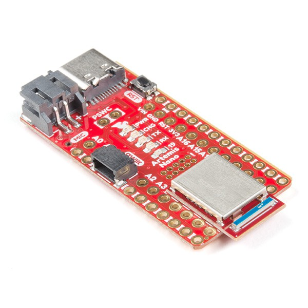

### Parts Needed:
* 1 x SparkFun RedBoard Artemis Nano
* 1 x USB A-to-C cable
* 1 x Li-Ion 3.7V 500mAh battery

### Video and Code Demonstration:
1. Blink it up: the following video shows the board blinking its builtin LED.

[](https://youtu.be/njZcvr3d-II) 

2. Serial: the following video shows the working Serial port.

[](https://youtu.be/TS8YnWNQZ3k)

3. AnalogRead: the following video shows that the board's temperature increases after hot hair is blown onto it.  

[](https://youtu.be/1eO07-Ztc6g)

4. MicrophoneOutput: the following video shows that the highest frequency changes as I speak! 

[](https://youtu.be/mEYNIKG4enQ)

5. Whistling: I added a loop in the previous code file to blink the board when it hears a whistle.
```arduino
        if (ui32LoudestFrequency > 2500)
        {
            digitalWrite(LED_BUILTIN, HIGH);
            Serial.printf("WHISTLE\n");
            }
        else {
            digitalWrite(LED_BUILTIN, LOW);
            }
```

[](https://youtu.be/KoDkX6vNTrs)

[](https://youtu.be/-92acptAEIU)
