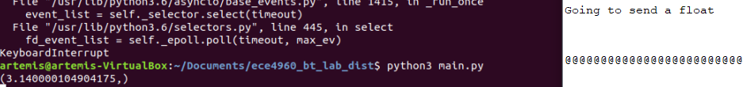

## Parts and Files Needed:
* 1 x SparkFun RedBoard Artemis Nano
* 1 x USB A-to-C cable
* 1 x Bluetooth adapter
* Lab 2 Distribution Code

## Tasks:
### 1. USB passthrough Bluetooth  
The bluetooth module we used in the lab is USB_BT4LE.  In order to set up the port in VM, I downloaded the VirtualBox extension pack and set the USB port to USB 2.0.  I also had to disable the adapter on my host computer so it would run in VM.  I selected the bluetooth device in VM by going to device -> USB -> [device name].  When selected, running lsusb in the terminal should show the connected bluetooth device: 
<p align="center">
    
</p>
I also had to install bleak on python3 by running python3 -m pip install bleak.


### 2. Connect to the Artemis Board
By uploading the provided code, the artemis board blinks the blue LED rapidly and shows this in the serial window: 
<p align="center">
    
</p>


### 3. Ping your Robot
In the VM, I ran main.py and was able to get a response from the robot after uncommenting await theRobot.ping().  The round-trip latency is shown in the histogram below.  The average is calculated to be around 150 ms, but most of the data points lie in range (105 - 120) and some in range (170 - 200).  The length of ping can be found in the case PING, where the length is stored in variable l_Rcvd.  After printing this value in the serial monitor, I found that the length is 99 bytes.  To find the average bluetooth transmission rate in bits/sec, I did 99 bytes * (8 bits/1 byte) *(1/0.15s) = 5280 bits/second.  For roundtrip, the average transmission rate is around 10kbits/second.  Compared to the serial transmission rate, which is 115200 bits/second, bluetooth transmission is 10 times faster! 
<p align="center">
    
</p>
<p align="center">
    
</p>


### 4. Request a Float
In order to request a float over bluetooth, the res_cmd type must be set to GIVE_FLOAT.  In this case, the float is 3.14, and the pointer to the number is stored in the beginning of the data packet.  The size of the packet equals the size of the command type (1 byte) plus the size of data length, and the size of float(4 bytes).  The code is shown below: 
```c
res_cmd->command_type = GIVE_FLOAT;
((float *)(res_cmd->data))[0] = 3.14f;
amdtpsSendData((uint8_t *)res_cmd, sizeof(cmd_type_e) + sizeof(uint8_t) + sizeof(float));
```
The float number pi displays successfully on the screen shown below.  The number displayed isn’t exactly the number I sent over, which means that the bluetooth data transmission can be slightly inaccurate.  
<p align="center">
    
</p>


### 5. Test the Data Rate
To test the speed and reliability of the bluetooth connection, I sent 32-bit and 64-bit integers over the dataline.  I first sent a small packet with only two numbers(14 bytes), and I compared its time with the time sending a big packet with 86 bytes.  The small packet consists of a 32-bit number and a 64-bit number.  The large packet consists of a 32-bit number and 10 64-bit numbers, and I used a for loop to store each number into the dataline.  The histograms for each type of packet sent are shown below.  The average time for the 14-byte packet is 10.69 ms, and the average time for the 86-byte packet is 10.72 ms.  Therefore, the time slightly increases with the number of packets sent.  The packet loss for small packets is 51% based on the number of packets sent and the number of packets received, and 90% for large packets.  These numbers are a lot bigger than I expected, so maybe data was being sent too quickly.
<p align="center">
    
</p>
<p align="center">
    
</p>
The transmission of small packets are shown below: 
<p align="center">
    
</p>
The transmission or large packets: 
<p align="center">
    
</p>


In the code below, the commented out section sends over the large packet.  The micros() function tells the time that each packet(numbered by pkcount) is being sent.  In addition, bytestream_active is set to 1 in the case START_BYTESREAM_TX.  The receiving side unpacks the small packet using the code below: 
```c
If (code == Commands.BYTESTREAM_TX.value):
	print(unpack(”<Iq”, data))
```
If the packet sent over is the large packet, “Iq” is replaced with “Iqqqqqqqqqq” to receive all the bytes.

```c
if (bytestream_active)
    {
        res_cmd->command_type = BYTESTREAM_TX;
        res_cmd->length = 14;
        //TODO: Put an example of a 32-bit integer and a 64-bit integer
        //for the stream. Be sure to add a corresponding case in the
        //python program.
        //Serial.printf("Stream %d \n", bytestream_active);
        ((uint32_t *)(res_cmd->data))[0] = 12; //send a 32-bit data that is 12, 4 bytes
        uint64_t num = 24;
        memcpy(res_cmd->data+4, &num, 8); //uint64 is 8 bytes long
        amdtpsSendData((uint8_t *)res_cmd, 14); //12 for both numbers and 2 for type and length
        //send more num
        /*
        uint64_t morenum = 25;
        for (int i = 1; i < 10; i++){
          memcpy(res_cmd->data+12+8*i, &morenum, 8);
          morenum = morenum + 1;
          }
        amdtpsSendData((uint8_t *)res_cmd, 86); //8*10+4+2
        */
        //time
        unsigned long t = micros();
        Serial.printf("Package %d: Time is %d \n", pkcount, t);
        pkcount++;
    }

```

### 6. Additional Command Framework
In order to support lab 6 where we have to send IMU data, I created two more commands in commands.h: REQ_IMU and GIVE_IMU.  The IMU data consists of 9 float numbers.  The code is shown below.  I put in 9 float numbers (all are 3.14) in the dataline.
```c
case REQ_IMU:
            Serial.println("Going to send 9 floats as IMU message");
            res_cmd->command_type = GIVE_IMU;
            for (int i = 0; i<9; i++){
              memcpy(res_cmd->data+4*i, &pi, 4); //float is 4 byte long
              }
            amdtpsSendData((uint8_t *)res_cmd, sizeof(cmd_type_e) + sizeof(uint8_t) + 9*sizeof(float));
            break;
```
Additionally, I added another case in main.py to unpack the IMU data being sent.  Since there are 9 float numbers, the unpack format is "fffffffff".
```c
    if (code == Commands.GIVE_IMU.value):
        print(unpack("(<fffffffff"), data)
```
The bluetooth receives the data as shown below: 
<p align="center">
    
</p>
