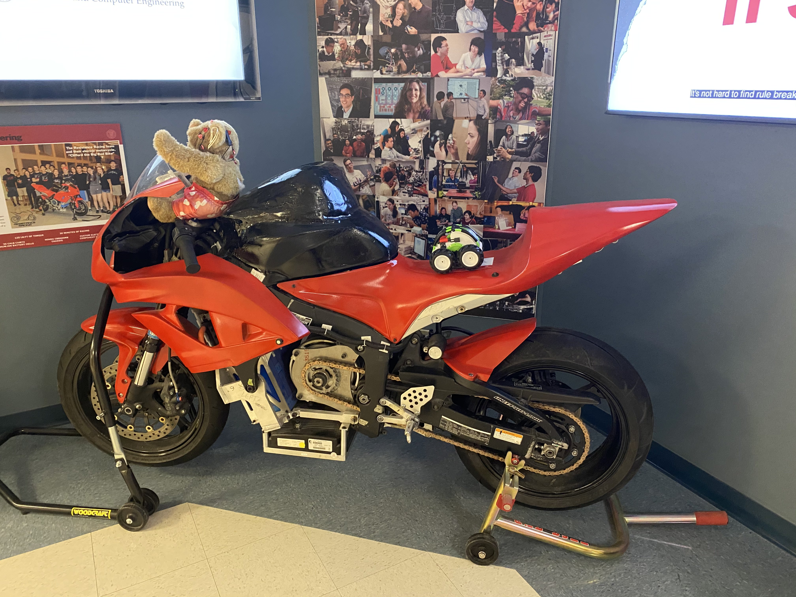
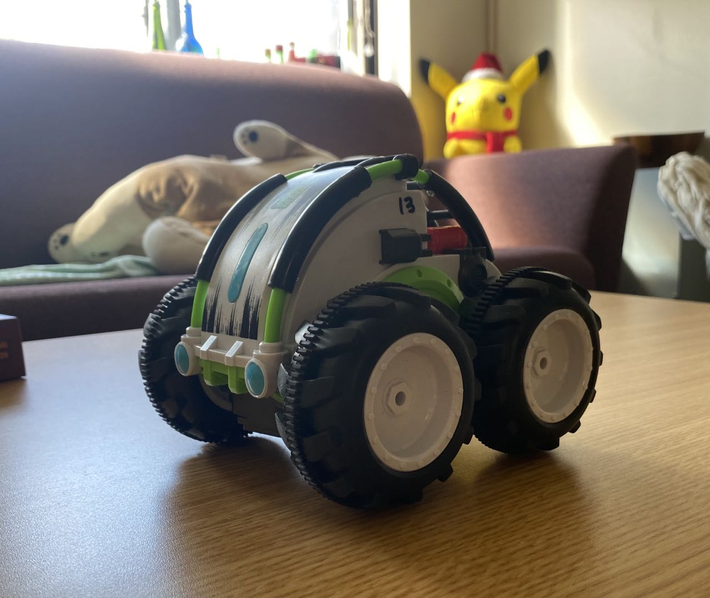

### The RC car on top of a motorcycle! 

    

## Parts and Files Needed:
* 1 x RC Car
* 2 x Battery Pack
* Different types of surfaces for testing

## Characterizing the RC Car (collaborated with Katie and Jade):
### 1. Basic Properties
* Dimension: 5.5 in x 6.25 in x 4.75 in
* Wheel Diameter: 3 in
* Weight: 45.9g without battery, 54g with battery
* Charging time: 4 - 5 Hours
* Battery life time: Depends on speed settings and the consistency of use.  When it was on/off during filming, it was about 20-30 minutes.

    

### 2. Speed Testing
We tested the speed of the car by driving it around the hallway of Phillips second floor.  The first table shows the fast speed and the second table shows the slow speed.  The fast speed of the car various from 2.25 m/s to 2.53 m/s, averaging around 2.4 m/s.  The slow speed various from 1.17 m/s to 1.33 m/s, averaging around 1.29 m/s.

| Time (s)    | Distance (m)|
| ----------- | ----------- |
| 3.8         | 9.144       |
| 2.4         | 6.069       |
| 3.5         | 9.144       |
| 3.6         | 9.144       |
| 4.06        | 9.144       |

| Time (s)    | Distance (m)|
| ----------- | ----------- |
| 3.44        | 4.57        |
| 3.32        | 4.57        |
| 3.91        | 4.57        |

### 3. Acceleration
The acceleration of the car was a little difficult to test because we couldn't tell when the car reaches a certain speed.  From the video below, it looks like the car takes around two squares (2 ft, 0.61 m) to reach its full speed, which is 2.4 m/s from the previous section.  Therefore, we can estimate the acceleration is around 3.93 m/s^2.  

<iframe width="560" height="315" src="https://www.youtube.com/embed/8Lcm07swSDM" frameborder="0" allow="accelerometer; autoplay; clipboard-write; encrypted-media; gyroscope; picture-in-picture" allowfullscreen></iframe>

### 4. Braking Distance 
We tested the braking distance of the car as below.  We weren't able to tell the hard stopping distance of the car in fast mode because the car just flips over.  The testing procedure is shown in video below.
|Car Speed Mode| Distance (m)|
| -----------  | ----------- |
| Slow         | 0.102       |
| Slow         | 0.127       |
| Slow         | 0.152       |
| Slow         | 0.127       |
| Slow         | 0.152       |
| Fast         | N/A         |

<iframe width="560" height="315" src="https://www.youtube.com/embed/s354ff9yiBU" frameborder="0" allow="accelerometer; autoplay; clipboard-write; encrypted-media; gyroscope; picture-in-picture" allowfullscreen></iframe>

### 5. Performance on different surfaces 
The car is able to handle grass, carpet, concrete, and peat surfaces.  It was having a little hard time on peat, but other than that it was going very smooth. The video of our testing is shown below: 

<iframe width="560" height="315" src="https://www.youtube.com/embed/qeUlRmqmca8" frameborder="0" allow="accelerometer; autoplay; clipboard-write; encrypted-media; gyroscope; picture-in-picture" allowfullscreen></iframe>

### 6. Tricks 
The car can do many stunts!  It can easily get back on its wheels when it's flipped to the sides or the back.  All we had to do was to move the joysticks in the speedy mode.  We also created a ramp, and it was able to drive over it.  It was easier to manually control the car when it was in slow mode, because it's less likely to flip over.  The video demonstration is shown below: 

<iframe width="560" height="315" src="https://www.youtube.com/embed/m3y1oS1I_Io" frameborder="0" allow="accelerometer; autoplay; clipboard-write; encrypted-media; gyroscope; picture-in-picture" allowfullscreen></iframe>

        