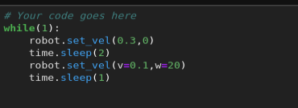

## Parts and Files Needed:
* 1 x SparkFun RedBoard Artemis Nano
* 1 x USB A-to-C cable
* 1 x Li-Ion 3.7V 400 or 500mAh battery
* 1 x Sparkfun Qwiic motor driver
* 1 x R/C stunt car and NiCad battery
* 1 x Qwiic connector
* 1 x Small screwdriver 
* 1 x Wirecutter 


## Manual Open Loop Control of the RC Car
### 1. Communicating with the Motor Driver
I used the code from File->Examples->Wire->Example1_wire and checked the I2C address of the motor driver.  The I2C address was found to be 0x5D. 
<p align="center">
    
</p>

### 2. Taking apart the RC Car
I first unscrewed and removed the bumper of the RC car.  I took out the battery and cut the power wires and motor wires from the PCB.  I then followed the hookup guide and connected the wires to the motor driver:
<p align="center">
    
</p>
I had to be very careful with the motor driver wires because they could be easily pulled off.  I also had to make sure that the red wire from the battery cable is connected to VIN on the motor driver.  Here's a picture of the car during testing, with everything hooked up: 
<p align="center">
    
</p>

### 3. Testing the Car
In order to test the car with the new motor driver, I downloaded the SCMD library from Arduino.  In the MotorTest example, I first changed the I2C address to 0x5D:
```c
  myMotorDriver.settings.I2CAddress = 0x5D; //config address to motor driver address
```
Originally, the code inside the loop goes through all 34 motors and step through them.  Since we only have two motors, I simply set motor 0 and motor 1.  The following code drives the robot straight on both motors at 60.  
```c
    myMotorDriver.setDrive( 1, 1, 60); //Drive motor 1 forward at 60
    myMotorDriver.setDrive( 0, 0, 60); //Drive motor 0 forward at 60
```
In order to figure out the lower limit for which each motor still turns, I tested them at 40, 30, 25, and 20.  At 40, both motors were able to turn without a starting push.  At 30, both motors can turn, but they need a little push manually.  At 25, motor 1 can turn with a little push but not motor 0.  At 20, both motors weren't able to turn.  A demonstration video is shown below: 
<iframe width="560" height="315" src="https://www.youtube.com/embed/mAgQ_bf35cc" frameborder="0" allow="accelerometer; autoplay; clipboard-write; encrypted-media; gyroscope; picture-in-picture" allowfullscreen></iframe>

### 4. Robot Assembly
After testing the motor driver, I assembled the robot by putting the motor driver inside and routing the connector to the outside of chassis through the hole for the old start buttom.  I used a rubber band because the tape wasn't strong enough to hold them down.
<p align="center">
    
</p>
Here's a video of the robot doing some turns.  Since the floor surface wasn't super flat in my apartment, the turns weren't exactly the same.  One thing I realized was that the turns can only happen on my floor surface/carpet when the speed of the motors is above ~180 due to the traction of the wheels.  If the speed is too low, the robot gets stuck instead of turning.  It helps if I make the robot stop before it turns and if I make it turn using both wheels.  
<iframe width="560" height="315" src="https://www.youtube.com/embed/ZeQ5ytcIdoc" frameborder="0" allow="accelerometer; autoplay; clipboard-write; encrypted-media; gyroscope; picture-in-picture" allowfullscreen></iframe>

```c
    myMotorDriver.setDrive( 1, 1, 60); //motor 1 drives straight
    myMotorDriver.setDrive( 0, 0, 60); //motor 0 drives straight
    delay(1000);
    myMotorDriver.setDrive( 1, 1, 0); //Stop
    myMotorDriver.setDrive( 0, 0, 0); //Stop
    delay(500);
    //turn left
    myMotorDriver.setDrive( 1, 1, 180); //motor 1 turns
    myMotorDriver.setDrive( 0, 1, 180); //motor 0 turns the other direction
    delay(750);
    myMotorDriver.setDrive( 1, 1, 60);
    myMotorDriver.setDrive( 0, 0, 60); 
    delay(1000);
    myMotorDriver.setDrive( 1, 1, 0); //Stop
    myMotorDriver.setDrive( 0, 0, 0); //Stop
    delay(500);
    //turn right
    myMotorDriver.setDrive( 1, 0, 180); //motor 1 turns the other direction
    myMotorDriver.setDrive( 0, 0, 180); //motor 0 turns
    delay(750);
```

## Open Loop Control Of Virtual Robot
Need: 
* Lab4 codebase
* Jupyter Notebook

### 5. Setup
The part of the lab needs the Jupyter notebook and the lab4 codebase downloaded via terminal.  After following the instructions on the website,  I changed the kernel to Python 3(it was set to Python 2 before).   

### 6. Rectangular Loop
In order to make the robot go in a rectangular loop, I needed to set the linear velocity (for straight lines) and angular velocity (for turns).  After some googling, I realized that v = r X w, where v is the linear velocity and w is the angular velocity per unit time.  Therefore, v/w would be the radius that the robot can turn.  Since we want a fairly tight turn, I set the ratio of v/w to be small.  After a couple trials, I decided that v=0.1 and w=20 would be a good turn radius.  
To make the robot go straight, I set the linear velocity to 0.3 and the angular velocity to 0.  My code is below: 
<p align="center">
    
</p>
Here's the video of the virtual robot going in a rectangular loop:
<iframe width="560" height="315" src="https://www.youtube.com/embed/ksp-Zb2yLP8" frameborder="0" allow="accelerometer; autoplay; clipboard-write; encrypted-media; gyroscope; picture-in-picture" allowfullscreen></iframe>


