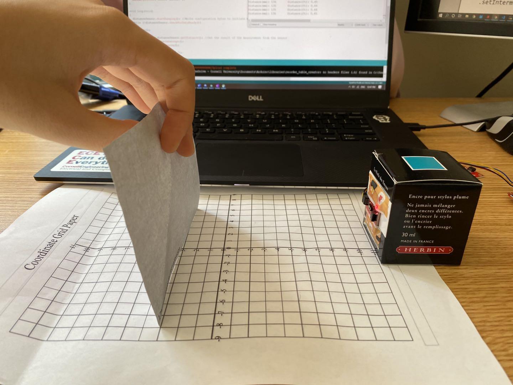
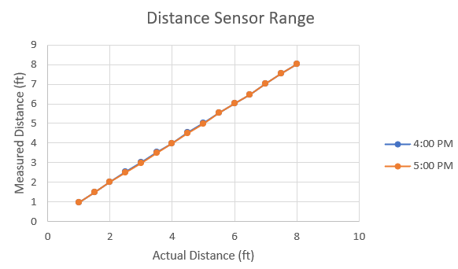

## Parts and Files Needed:
* 1 x SparkFun RedBoard Artemis Nano
* 1 x USB A-to-C cable
* 1 x 4m ToF sensor
* 1 x 20cm proximity sensor
* 1 x Li-Ion 3.7V 400 or 500mAh battery
* 1 x Sparkfun Qwiic motor driver
* 1 x R/C stunt car and NiCad battery
* 1 x Qwiic connector
* 1 x Gray target
* 1 x Ruler or graph paper
* 1 x Double sided tape
* 1 x Small screwdriver (Phillips or flathead)
* 1 x Wirecutter (you can also make do with a scissor)


## RC Car Obstacle Avoidance

### 1. Prelab: Distance Sensors
Reference: https://www.seeedstudio.com/blog/2019/12/23/distance-sensors-types-and-selection-guide/
Distance sensor functions by outputting a signal and measuring the change when the signal returns.  There are many types of distance sensors such as the ultrasonic sensor, IR distance sensor, laser distance sensor (LIDAR), and ToF sensor.  I'll discuss them in details below:
* Ultrasonic sensor: It detects the distance to objects by emitting high-frequency ultrasonic waves.  It calculates the time that sound wave takes to bounce back to itself as a distance measurement.  It's used in many robotic applications, UAVs, and cars (apparently Tesla uses them for their autopilot program).  The advantage of the ultrasonic sensor is that it can work under different light settings and consume low power.  However, its range can be limited.
* IR Distance Sensor: We used this type of sensor in 3400!  The IR sensor has two lenses, one lens that emits a light beam and a photodetector that gets the reflected beam.  The IR sensor measures distance based on the principle of triangulation, and it calculates the position and distance based on how the light is reflected.  Its advantage is that it can be used for daytime and nighttime use (good for security cameras), and it's able to measure complex surfaces unlike the ultrasonic sensors.  
* LIDAR: LIDARs measure the range of targets through light waves and the time it takes for them to travel back.  It's used mostly in autonomous vehicles today, and I actually researched a couple during my summer internships.  LIDARs are extremely expensive and requires a lot of hardware/software support, but it's able to measure distance with great range and accuracy.  
* ToF Sensors: This is what we use in the labs!  ToF sensors measures the time it takes for a wave pulse to reflect off an object and returns back to it.  We use it in our course because it's able to provide faster (almost in time) readings at great accuracy and range.  It's slightly more expensive compared to IR and ultrasonic sensors, and its performance can be affected by direct sunlight and reflective surfaces.  
Overall, for a fast robot class application, ToF sensors are the most suitable because it's able to provide fast and accurate readings with a decent price.  However, we have to be careful with the testing environment because it's easily affected by the reflective surface.  

### 2. Testing the Proximity Sensor
I first downloaded the SparkFun VCNL4040 Proximity Sensor Library in Arduino and hooked up the sensor to the Artemis board.  I then found its I2C address(0x60) by running Example1_Wire.  The address matches the one given in the datasheet.  
<p align="center">
    
</p>
I then tested the proximity sensor using Example4_AllReadings.  The setup is shown below:
<p align="center">
    
</p>
I measured the intensity data at two different times: 4pm and 8pm; I also used both the blue sticky note and a red box as my subjects.  The mappings are shown below.  
<p align="center">
    
</p>
<p align="center">
    
</p>
<p align="center">
    
</p>
The sensor actually takes a while to update the values.  It takes approximately 4 seconds to update the intensity values when I moved the object from 0 to 20cm.  The values in the Serial monitor updates every 10ms.  

### 3. Testing the Time of Flight Sensor 
I firsted downloaded the SparkFun VL53L1X laser distance sensor library onto the arduino.  I then used the same method as above to find the I2C address for the ToF sensor, which turns out to be 0x29 (datasheet says 0x52 as default).  This is because I2C addresses are only 7 bits long, so the LSB is not part of the address.  
I then calibrated the sensor using Example7_Calibration and the piece of grey target from the kit.  The setup is shown below: 
<p align="center">
    
</p>
The code didn't work at first, so I had to modify it a little by adding startRanging().  Here's the sensor calibrated successfully: 
<p align="center">
    
</p>
I also tested out the relevant functions such as .setInterMeasurementPeriod(), which is how fast the sensor detects and updates the distance.  If the robot is fast (which is what we want), we want to set it as low as possible, aka equal to the timing budget.  
In ArduinoPlotterOutput(), the minimum timing budget is 20ms for the short distance and 33ms for medium and long distance. Since the timing budget determins how fast we want to data to be outputted, we want to keep it low.  To be safe, I set the timing budget to 33 and the measurement period to be 40.  
For the mode of the ToF sensor, I expect to use the .setDistanceModeLong() or .setDistanceModeMedium() because the robot is moving at a fast speed.  Therefore, we want the detection range to be longer so the robot has enough time to react.  
When I change the distance rapidly, the sensor rangeStatus will show “Signal Fail”.  I think this means to avoid rapid turns, stops, and glitches when programming the robot.  Signal failures can result in inaccurate reading of the distance data.
<p align="center">
    
</p>
In order to test the range of the sensor, I set up in Phillips Hall and used a tape measure.  The setup is below: 
<p align="center">
    
</p>
I tested 8 feet of distance at two different times, and the accuracy graph is shown below.  The ToF is relatively accurate, and the texture and color don't seem to affect it that much.  I would assume that an object with a reflective surface would read a different value than an object without a reflective surface.  
<p align="center">
    
</p>
I also calculated the time it takes for the ToF sensor to read the values using code below: 
```c
  long startTime = millis();
  int distance = distanceSensor.getDistance(); //Get the result of the measurement from the sensor
  long endTime = millis();
```

* Reading value: ~1 ms
* ToF Ranging (without Stop Ranging): 1.62 ms
* ToF Ranging (with Stop ranging): 2.01 ms

### 4. Robot Obstacle Avoidance
The goal is to make the robot run without hitting any obstacles.  I first mounted the sensors onto the robot as in the instructions.  The assembled robot is shown below: 
<p align="center">
    
</p>
I first tested each sensor individually to see if they work on the robot.  I then integrated them together and wrote the code for obstacle avoidance.  I combined the setup code for all the sensors, and I made the robot turn when the proximity sensor/distance sensor has detected within a certain range (and drive straight otherwise).

```c
    if (distance < 700 || proxValue > 50) {
        Serial.println("turning");
        myMotorDriver.setDrive( 1, 0, 150); //motor 1 turns the other direction
        myMotorDriver.setDrive( 0, 0, 150); //motor 0 turns
        delay(300);
      }
```

When I increased the speed of the robot, I also had to increase the distance it needs to detect obstacles (for extra buffer).  I also noticed that the reflective surface of the floor can make the robot see things when it's not supposed to.  I demonstrated the robot avoiding obstacles in the video below.  I attempted 180 and 200 for speed, and I think the battery was dying off at the end so it didn't look as fast.  I also noticed that the proximity sensor took a long time to update values, so my robot depends mostly on the distance sensor.

<iframe width="560" height="315" src="https://www.youtube.com/embed/befxTTZBrZk" frameborder="0" allow="accelerometer; autoplay; clipboard-write; encrypted-media; gyroscope; picture-in-picture" allowfullscreen></iframe>

## Virtual Robot Obstacle Avoidance
Need: 
* Lab5 codebase
* Jupyter Notebook

The part of the lab needs the Jupyter notebook and the lab5 codebase downloaded via terminal.  After following the instructions on the website,  I changed the kernel to Python 3(it was set to Python 2 before). 
I realized that the laser beam is very thin, and the robot doesn't detect the wall if its side is almost parallel to the wall when it's moving (shown at the end of the video where it crashes at the corner).  I set the speed to 1 m/s and make the robot turn for a little bit at a time so it doesn't miss another wall while it's turning.  I set the laser distance to 1 m so the robot has enough time to turn (I tried at a smaller distance, and it can't get the side walls as well if it's coming up close on its side).  I also tried 5 m/s and the robot crashes on the second turn due to the speed.  I think the more ideal way is to slow down the robot within a certain distance that the laser detects.  Below is a video of the robot operating at 1 m/s with minimum crashing and collision.
<iframe width="560" height="315" src="https://www.youtube.com/embed/dQO1uGPHylE" frameborder="0" allow="accelerometer; autoplay; clipboard-write; encrypted-media; gyroscope; picture-in-picture" allowfullscreen></iframe>


