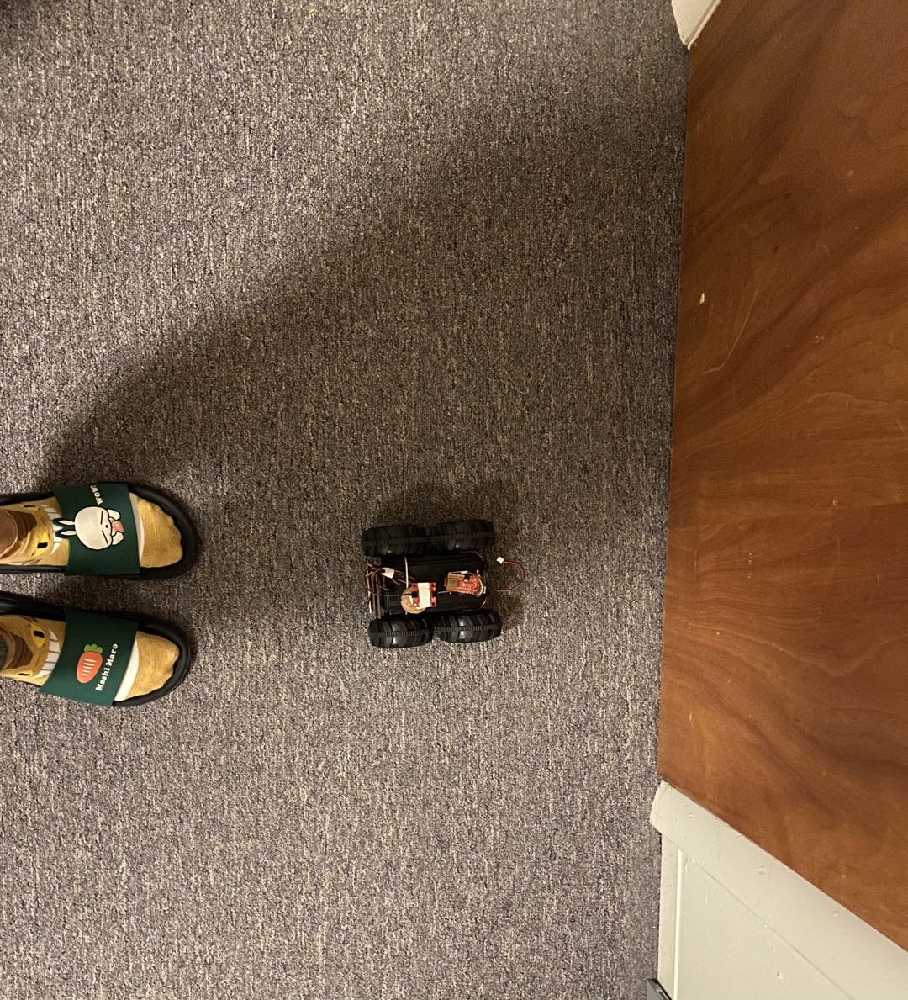

## Parts and Files Needed:
* 1 x SparkFun RedBoard Artemis Nano
* 1 x USB A-to-C cable
* 1 x Li-Ion 3.7V 400 or 500mAh battery
* 1 x Sparkfun Qwiic motor driver
* 1 x R/C stunt car and NiCad battery
* 1 x Qwiic connector
* 1 x 9-axis IMU
* 1 x TOF sensor


## 6a: IMU, PID, and Odometry

### 1. Prelab: Downloading SerialPlot, Reading up on IMU Documentation
In order to visualize the IMU data (like the ones shown in class), I downloaded SerialPlot from here: https://hackaday.io/project/5334-serialplot-realtime-plotting-software.
I also read up on the IMU documentation.  The IMU has three sensors: the accelerometer, the gyroscope, and the magnetometer.  The board has the orientations drawn on the surface, where the gyroscope and the accelerometer share the same orientation and the magnetometer has its own.  
I also installed the PID library for PID control.

 

### 2. Setting up the IMU 
I first downloaded the SparkFun 9DOF IMU Breakout Library in Arduino and hooked up the sensor to the Artemis board.  I then found its I2C address(0x69) by running Example1_Wire.  The address matches the one given in the datasheet.  
<p align="center">
    
</p>
I then ran Example1_Basics on the IMU and checked the sensor values.  When the robot is stationary, both the gyroscope and accelerometer data are close to 0 for the x and y values.  The accelerometer z-axis data was around 1000 cm/s^2 due to gravity.  The gyroscope data drifts overtime.  When I move the robot in one direction, the corresponding accelerometer/gyroscope data increases/decreases.
<p align="center">
    
</p>
The accelerometer data is shown below: 
<p align="center">
    
</p>

### 3. Accelerometer
In order to calculate pitch and roll, I used the equations from class: 
```c
  pitch_a = atan2(myICM.accX(), myICM.accZ()) * 180/M_PI;
  roll_a = atan2(myICM.accY(), myICM.accZ()) * 180/M_PI;
```
When the robot is flat on the table, the roll and pitch are both 0s: 
<p align="center">
    
</p>
I first tested the robot's pitch, which is taken when the robot is on its sides: 
<p align="center">
    
</p>
The outputs of the pitch at +90 and -90 degrees are shown below: 
<p align="center">
    
</p>
<p align="center">
    
</p>
The robot's roll is tested using a similar method, except it's measuring the robot's tilt standing up on its front wheels/back wheels instead of on its sides: 
<p align="center">
    
</p>
The outputs of the roll at +90 and -90 degrees are shown below: 
<p align="center">
    
</p>
<p align="center">
    
</p>
Summary: 
* Pitch (90) = 90.09 
* Pitch (-90) = -87.68
* Roll (90) = 88.50
* Roll (-90) = -89.56
From the summary, we can see that the accelerometer data is pretty accurate both instantaneously and over a period of time.  

Since there's certain noise associated with the pitch and roll, I tried using FFT and plotting the frequency response of the sensor when I tap on it.  I used the FFT python tutorial and modified the code a little bit: 
```
import numpy as np
import matplotlib.pyplot as plt
from math import pi
from scipy.fftpack import fft
import os
N = 924
os.chdir(r'C:\Users\emily\OneDrive - Cornell University\Emily\school\7th_semester\Fast Robots\Lab3')
h = open('noisedata.txt', 'r')
content = h.readlines()
timestamp = []
data = []
for line in content:
        s = line.split(',')
        timestamp.append(int(s[0]))
        data.append(float(s[1]))
print(timestamp)
print(data)
sample_rate = int(N/2)
frequency = np.linspace (0.0, 5000, N//2)
freq_data = fft(data)
y = 2/N * np.abs (freq_data [0:np.int (N//2)])
plt.plot(frequency, y)
plt.title('Frequency domain Signal')
plt.xlabel('Frequency in Hz')
plt.ylabel ('Amplitude')
plt.show()
```
However, the frequency response comes out pretty noisy: 
<p align="center">
    
</p>
Since it's difficult to figure out a cutoff frequency using the FFT data, I estimated the cutoff frequency to be around 300 Hz.  In class, the alpha value for the filter is T/(T+RC), and after trial and error, I figured that the best alpha value is 0.25.  If alpha is low, the noise gets smoothed out more, but the measurements become laggy.  Therefore, 0.25 is a good balance.  I then implemented the filter into the pitch and roll: 
```c
  alpha = 0.25;
  pitch_a_LPF = alpha*pitch_a + (1-alpha)*old_pitch_a;
  old_pitch_a = pitch_a_LPF;
  roll_a_LPF = alpha*roll_a + (1-alpha)*old_roll_a;
  old_roll_a = roll_a_LPF;
```
Below shows pictures of pitch and roll before and after the LPF.  The data appears to be a lot smoother (thought with a small delay).    
<p align="center">
    
</p>
<p align="center">
    
</p>

### 4. Gyroscope
I calculated pitch, roll, and yaw angles from the gyroscope using equations from class.  Here's the code: 
```c
  currentTime = millis();
  dt = (currentTime - last_time);
  last_time = millis();
  pitch_g = pitch_g - myICM.gyrY()*dt/1000;
  roll_g = roll_g + myICM.gyrX()*dt/1000;
```
Below are the recorded pitch and roll from the gyroscope: 
<p align="center">
    
</p>
<p align="center">
    
</p>
The gyroscope data drifts overtime, so the pitch and roll also drift overtime.  They start off pretty accurate, but they move away from the actual values.  They are not as accurate as the accelerometer pitch and roll.  I tested the accuracy with increased sampling frequency (by removing the delays).  Increasing the sampling frequency increases the drift because the gyroscope data are obtained more frequently.  
To get a more accurate pitch and roll data, I combined both the accelerometer and gyroscope data and used LPF.  Here's the code : 
```c
  beta = 0.01;
  pitch = (pitch - myICM.gyrY() * dt/1000) * (1-beta) + pitch_a_LPF *beta;
  roll = (roll + myICM.gyrX()*dt/1000) *(1-beta) + roll_a_LPF*beta;
```
The pictures below show that the adjusted pitch and roll are not susceptible to drift and quick vibrations, and they are fairly accurate: 
<p align="center">
    
</p>
<p align="center">
    
</p>

### 5. Magnetometer
The following equation is used to convert magnetometer data into yaw: 
```c
  ym = myICM.magY() * cos(roll*M_PI/180) - myICM.magZ() * sin(roll*M_PI/180);
  xm = myICM.magX() * cos(pitch*M_PI/180) - myICM.magY() * sin(pitch*M_PI/180) * sin(roll*M_PI/180) + myICM.magZ() * cos(roll*M_PI/180) * sin(pitch*M_PI/180);
  yaw = atan2(ym,xm)*180/M_PI;
```
Here's the data when the IMU rotates around.  As we can see, the yaw goes from 180 to -180 degrees. 
<p align="center">
    
</p>
The magnetic north is shown below relative to the IMU on the robot (yaw equals approx -80): 
<p align="center">
    
</p>
The output is pretty robust to small changes in pitch, with little noise.  

### 6. PID Control
I first wrote a program to make the motor spin in opposite directions at increasing, the decreasing speeds while recording yaw.  The ramp code is shown below: 
```c
    myMotorDriver.setDrive( 1, 1, i); //Drive motor 1 forward at speed i
    myMotorDriver.setDrive( 0, 1, i); //Drive motor 0 backward at speed i
    if (i < 255 && increasing == 1){
      i = i + 1;
      }
    else {
      increasing = 0;
      i = i-1;
      }
    delay(500);
```
I realized that the robot turns in a very unpredictable fashion: sometimes the motors get stuck and the robot won't turn at all.  It can also become very jerky, so the turns aren't super smooth.  
Here's my estimated yaw graph I obtained from ramping up the robot: 
<p align="center">
    
</p>
Here's a picture of the maximum rotational speed graph.  Since the robot is really jerky, it's kind of hard to measure the maximum speed.  From the graph, the peak seems to be around 90 dps.  The increasing deadband is around 150 for motor 1 and 180 for motor 0.  The decreasing deadband is 180 for motor 0 and 155 for motor 1.  Since motor 1 is on the outside of the turning circle, it probably has an easier time, therefore a smaller deadband.  
<p align="center">
    
</p>
Here's a video of the robot trying to do the ramp.  It gets super jerky and inconsistent, and I think it might be caused by the strong traction of the wheels.
<iframe width="560" height="315" src="https://www.youtube.com/embed/lmUiwYuDL_g" frameborder="0" allow="accelerometer; autoplay; clipboard-write; encrypted-media; gyroscope; picture-in-picture" allowfullscreen></iframe>
Assuming the slowest I can rotate the robot is around 90 dps, and the ToF measurement period to be 40 ms, the robot rotates around 3.6 degrees per reading.  If the robot is initially 0.5 meters away from the wall, then cos(3.6) = x/0.5, x = 0.0026 m, cos(3.6) = 0.5/y, y = 0.50099 m.  The picture below shows the x and y representations: 
<p align="center">
    
</p>
If the robot starts 45 degs from the wall, then x = 0.5tan(48.5) - 0.5tan(45) = 0.065 m, and y = 0.5/cos(48.5), y = 0.754 m.  
 <p align="center">
    
</p>
Since the sigma and signal values can't differ by too much, the speed of rotation must be relatively slow.  

Since I couldn't get the robot to rotate around its own axis (too jerky, sometimes it doesn't move at all), I decided to only do PID on one of its motors.  I used the PID library from arduino and set the input to be the gyroscope Z data and the output to be the motor speed.  I used a LPF on the gyroscope data because it was being noisy.  I used a setpoint of 150, and tested the robot when kp is 1, kp is 2, and kp is 5, which are shown below respectively: 
<p align="center">
    
</p>
<p align="center">
    
</p>
<p align="center">
    
</p>
As seen from the data above, kp=1 can produce a very smooth, steady rotational speed, but it's much below the setpoint (30 below).  When kp = 2, the speed varies by a little, but the average(~140) is a little closer to the setpoint.  When kp = 5, the rotational speed swings up and down more, but the average turns out to be the setpoint.  
I also tried changing the ki and kd values, but they created more swings in the rotational speed: 
<p align="center">
    
</p>
<p align="center">
    
</p>
I then decided to use only Kp = 2 in my PID design.  Here's a video of the robot going smoothly when Kp = 2 and setpoint = 150: 
<iframe width="560" height="315" src="https://www.youtube.com/embed/PuQvTH19mMw" frameborder="0" allow="accelerometer; autoplay; clipboard-write; encrypted-media; gyroscope; picture-in-picture" allowfullscreen></iframe>
If I use PID control on one wheel, the lowest setpoint speed that it can still turn is 60.  The speed can be much lower because the two wheels aren't trying to go opposite directions.  I also set the other non-PID controlled motor to be 40 just so the other motor can aid the other one.  Here's a video of it going (bc the circle is too big, it's only going half a circle):
<iframe width="560" height="315" src="https://www.youtube.com/embed/Hqod374Pkc4" frameborder="0" allow="accelerometer; autoplay; clipboard-write; encrypted-media; gyroscope; picture-in-picture" allowfullscreen></iframe>
I tried mapping using the ToF sensor when the robot rotates, and here's a screenshot of the sensor data when the robot rotating ~ 5 times.  Here's a picture of the setup and result: 
<p align="center">
    
</p>
<p align="center">
    
</p>
The mapping is fairly accurate and consistent.  It can map my feet and the wall at aroun 20 cm, and the hallway to be much farther away.  

## Odometry and Ground Truth in the Virtual Robot 
Need: 
* Lab6 codebase
* Jupyter Notebook

This part of the lab uses the plotter tool to visualize the difference between the odometry and ground truth pose estimates of the virtual robot.  Some definitions here: odometry is the use of data from onboard sensors to estimate change in position over time (aka the actual position evaluated by the robot itself).  This can be inaccurate because the velocity measurement overtime is used to calculate positions.  On the other hand, ground truth is the most accurate measurement -- it comes directly from a simulator/more accurate sensor.  In the virtual lab, ground truth is the exact position of the virtual robot.  
In the simulator, the odometry pose of the robot is obtained by robot.get_pose(), and the ground truth of the robot is obtained by robot.get_gt_pose().  I wrote a short script to plot the odometry and GT data on the plotter, with 0.5 seconds in between each plotting.  
<p align="center">
    
</p>
I first tested the robot positions when it's stationary.  I discovered that the odometry data drifts overtime (by quite a bit).  The positions shown by the odometry and GT data are also different when the robot is stationary.  I believe that calibration is needed in ordrer to align them.   
<p align="center">
    
</p>
Here's a test of the robot going in a perfect circle over a long period of time.  As shown in the picture, the odometry data drifts quite a bit overtime, but the GT shows a perfect circle.  The robot is going at 0.38 m/s.  
<p align="center">
    
</p>
I also compared the two data plots with different robot speeds.  At a slower speed, the robot odometry data is more stable (less noisy), but since the position drifts overtime, the overall path of the robot isn't as accurate as the odometry data under a faster speed.  Below shows a picture of the robot going at 0.16 m/s (slow) and a robot going at 0.38 m/s.  Therefore, it's important to find a balance between the overall path accuracy and the stability of the data.  
<p align="center">
    
</p>
<p align="center">
    
</p>
I also adjusted how often I sent data to the plotter.  For the robot going at 0.38 m/s, it's ideal to decrease the delay because the robot speed is relatively fast.  However, if I make the delay much lower (0.2), the data can be a little noisy.  I then set the delay to 0.4 for a good balance.  