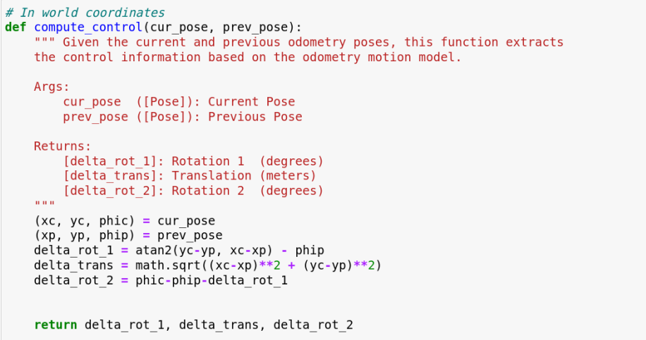
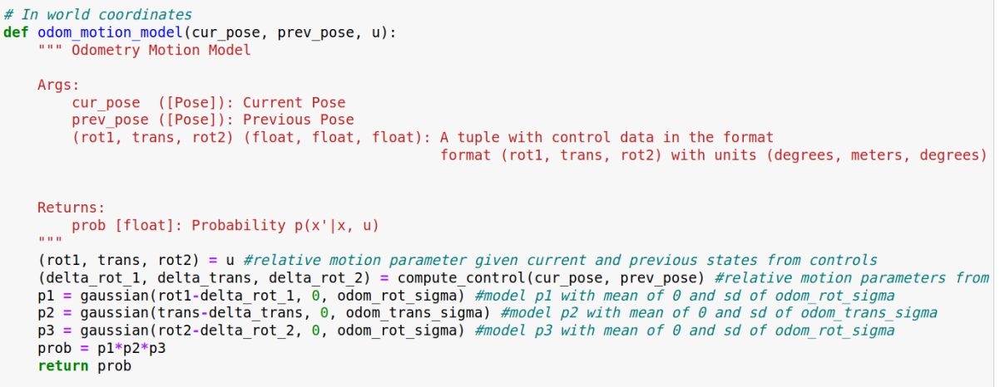
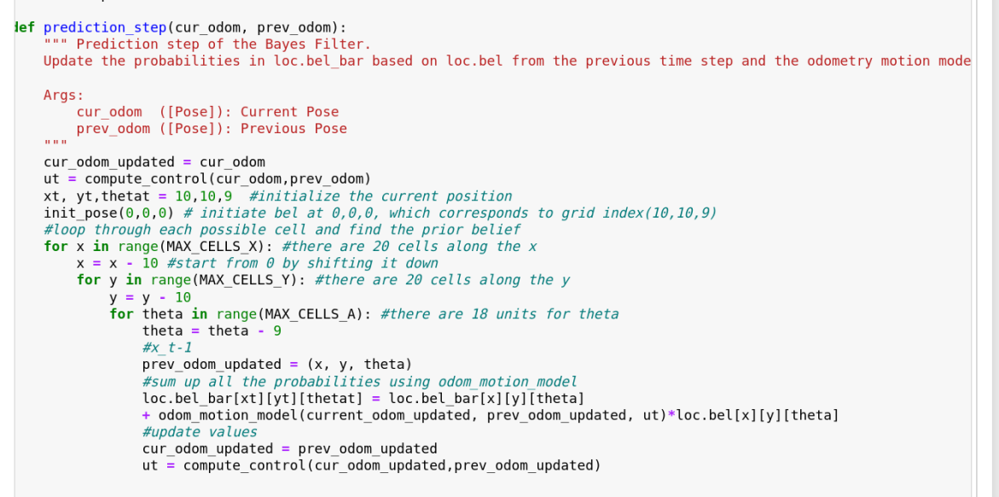
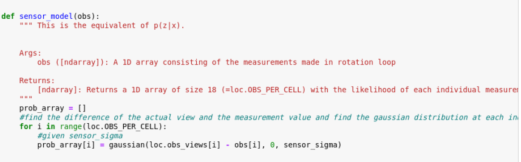
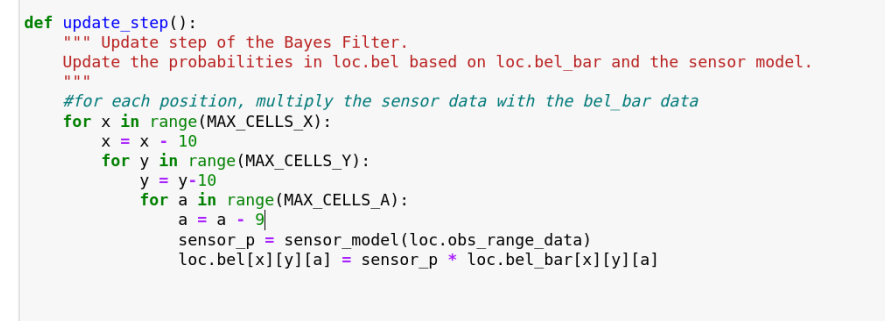
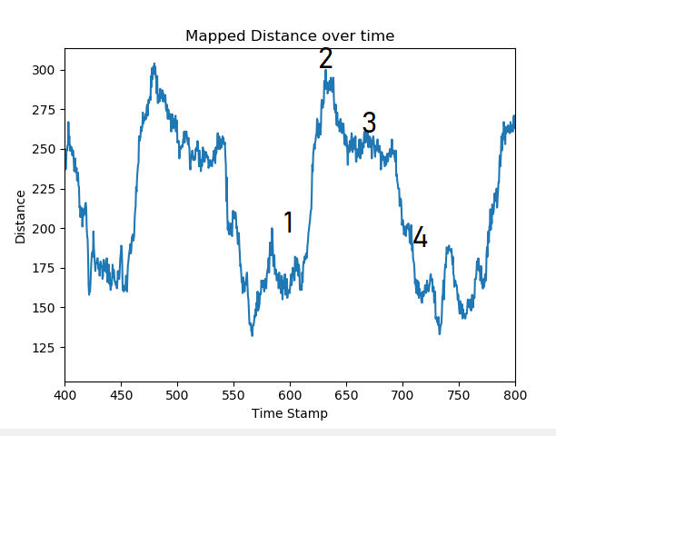
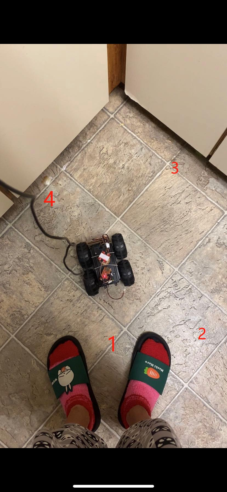
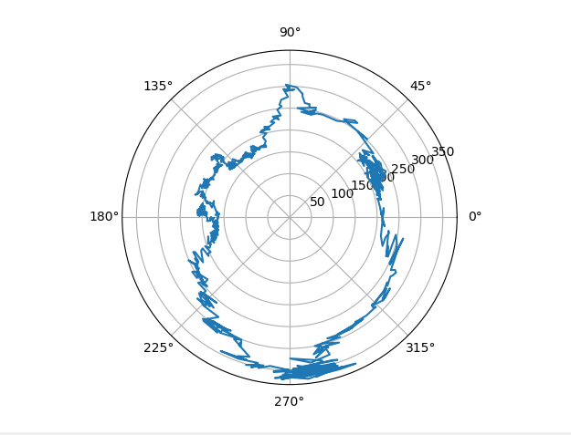

## Parts and Files Needed:
* 1 x Fully assembled robot, with Artemis, batteries, TOF sensor, and IMU.
* Lab 7 codebase
* Jupter Notebook

## 7a: Grid Localization using Bayes Filter

### 1. Bayes Filter Algorithm
The goal of this lab is to write pseudo code to perform grid localization using Bayes Filter.  In the code given, there are five major classes that are used to perform the robot's required functions: VirtualRobot, Mapper, BaseLocalization, Plotter, and Trajectory.  The VirtualRobot class obtains the latest odometry robot pose and the ground truth pose; the Mapper handles the various transformation operations between the world coordinates and the grid map; the Plotter helps to visualize and plot data; the BaseLocalization provides necessary functions needed for grid localization (such as the gaussian function).  The Trajectory provides a pre-planned collision free trajectory path to be executed by the robot.  
Below are some pseudocode I implemented for Bayes Filter.  I used equations from the lecture slides as reference.
1. compute_control: I used the equations in the lecture and found the relative rotations and translation given the previous position and the current position.

    

2. odom_motion_model: this function takes the relative motion parameter from odometry reading(which can be computed using the previous function) and the parameter given current and previous states to find the probability of the location given previous loation and control data.  

    

3. prediction_step: In order to find bel_bar for each location, we need to find the transition probability using the odom_motion_model and the bel for the previous position and sum them up.  The initial position is declared at 0,0,0 on the grid cells, and it loops through every possible xt by looping through each x, y, and a.  

    

4. sensor_model: The probability array is found by finding the difference of the actual view and the measurement view (input) and its gaussian distribution.  The standard deviation is given as sensor_sigma.

    

5. update_step: In order to update bel at each location, we simply multiply the bel_bar value of that location and the sensor probability.  The sensor probability can be found by using the sensor_model function and obs_range_data, which returns the range measurements of a robot after completing a rotation.  

    

## 7b: Mapping
#### 2. Sanity Check
I first did a robot scan at a corner of my kitchen room to make sure everything is working properly.  On full battery, I saw that the robot was able to spin slowly on its own axis with a setpoint of 180.  I used the same PID parameters from the last lab (P = 2).  Here's a video of it spinning slowly while scanning distance: 
<iframe width="560" height="315" src="https://www.youtube.com/embed/TZRY6MTgV9U" frameborder="0" allow="accelerometer; autoplay; clipboard-write; encrypted-media; gyroscope; picture-in-picture" allowfullscreen></iframe>
I plotted the ToF data after two rotational scans, and they seemed pretty consistent with each other.    

    

    

The rotation works really well when the battery is full, but sometimes the robot doesn't robot consistently/doesn't move at all.  For polar coordinates, I had to turn the robot at small increments and perform my measurements when it was sitting still.  As seen below, the polar data can roughly map out the kitchen corner (I had to use a different corner from before because my roommates were cooking), but there are some gitches and noises because the robot wasn't able to rotate smoothly.  I also realized the yaw data using magnetometere can be pretty inaccurate sometimes (I had to change its location on the robot several times because the data wasn't swinging from -180 to 180).  Additionally, if the robot rotates too quickly, the yaw can't capture the full swing.    

    

